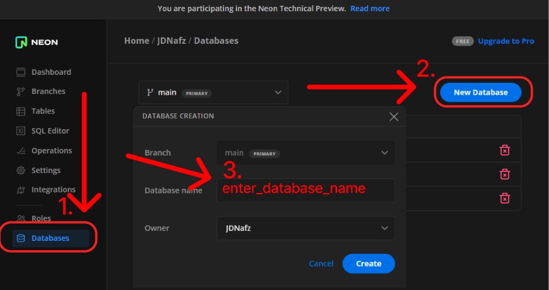
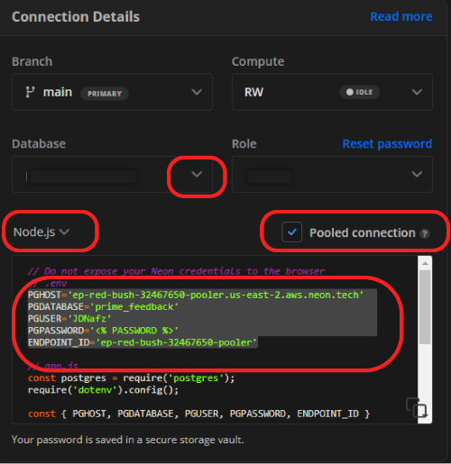
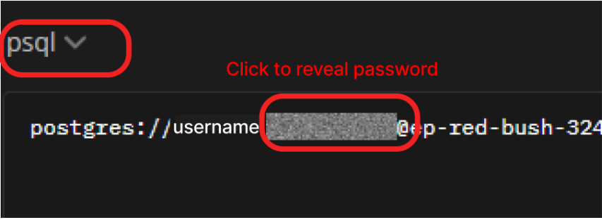

# How to connect to Neon 

Add the following to your files (explanation of where to find this info below)

### *.gitignore* 
    .env

### .env 
```
    ### Go to neon to find your version ###
    PGHOST='ep-red-bush-123456-pooler.us-east-2.aws.neon.tech'
    PGDATABASE='database_name'
    PGUSER='USERNAME'
    PGPASSWORD='PASSWORD'
    ENDPOINT_ID='ep-red-bush-32467650-pooler'
    # I used single quotes around mine, not sure if it is necessary
```


### server.js
```javascript
require("dotenv").config();
const PORT = process.env.PORT || 5000; // Double check this

```

### Pool.js
```javascript
const pg = require("pg");
let pool;
const { PGHOST, PGDATABASE, PGUSER, PGPASSWORD } = process.env;
if (process.env.DATABASE_URL) {
  pool = new pg.Pool({
    connectionString: process.env.DATABASE_URL,
    ssl: {
      rejectUnauthorized: false,
    },
  });
} else {
  pool = new pg.Pool({
    host: PGHOST,
    port: 5432,
    database: PGDATABASE,
    user: PGUSER,
    password: PGPASSWORD,
    ssl: {
      rejectUnauthorized: false,
    },
  });
}
module.exports = pool;
```


### Use Neon's 'SQL Editor' to initialize your table.

go use your database.sql file to copy and paste it in.

# You're done! Your project can now connect directly to neon


<br>
<br>
<br>
<br>
<br>
<br>
<br>

# Where to find the information?
Walkthrough how to find the information


## go to [neon](neon.tech) add a new database: 


Select Databases, click 'New Database', create a database_name, click create.






